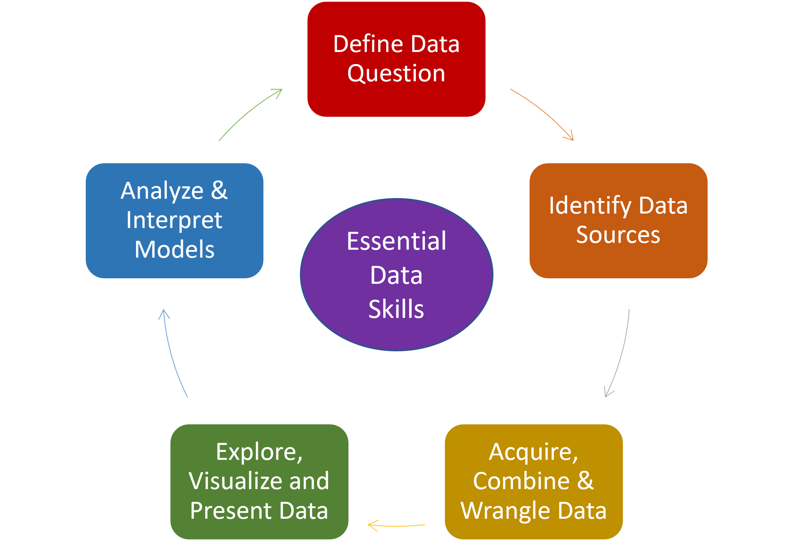
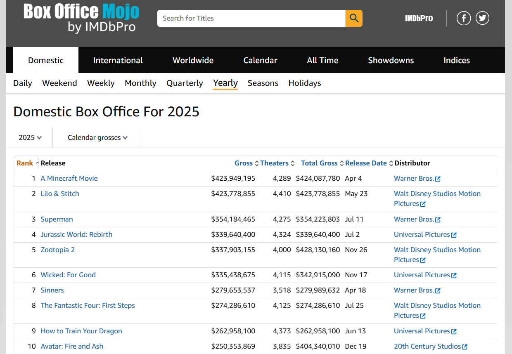

```{r setup, warning=F, message=F}
# this line specifies options for default options for all R Chunks
knitr::opts_chunk$set(echo=F)

# suppress scientific notation
options(scipen=100)
# avoid system issues
options(install.packages.check.source = "no")

# install helper package that loads and installs other packages, if needed
if (!require("pacman")) install.packages("pacman", repos = "http://lib.stat.cmu.edu/R/CRAN/")

# install and load required packages
# pacman should be first package in parentheses and then list others
pacman::p_load(pacman,tidyverse, magrittr, tidyquant, ggthemes, 
               RColorBrewer, highcharter, kableExtra, dygraphs, 
               gridExtra, plotly, gt, broom, emmeans, multcomp,
               multcompView, quarto, renv)

# verify packages
#p_loaded()


```

# {}


# Intro

## Row

### Column {width="50%"}

**Background**

-   Exploratory Data Analysis (EDA) in 2026 should ideally be interactive and leverage AI tools.

-   This course teaches students to explore, analyze, and
    communicate with data.

-   Analysts and consultants learn these skills 'on the
    job'.

-   This course is designed to 'flatten' the learning curve
    for analysts at beginning of their career.
    
-   Learning to explore data without a defined 'right answer' helps build confidence and creative thinking skills.

### Column {width="50%"}


# Why?

## Row

### Column {width="50%"}

**Why Create this Course?**

-   Whitman students receive excellent technical and
    analytical training.
    
-   Putting those skills to use in a creative and
    exploratory setting is essential.
    
  
-   This course will encourage students to use a 'question' as a prompt for:
    
    -   aggregating and exploring data.
    -   understanding that the process is iterative.
    -   effectively communicating preliminary exploration findings visually, orally and in writing.
    -   effectively and securely collaborating with others.
    
<br>

**This course will help students to provide 'added value' in terms of critical thinking, creativity, and long term project management, beyond what AI tools can produce.**

### Column {width="50%"}


# Redundant?

## Row

### Column {width="65%"}

**Are there other courses on campus that teach these
    skills?**

-   Yes and No...not in one unified course.

    -   There are two psychology courses that list EDA as
        one of many topics they cover.
        -   These courses do not teach this material
            interactively or include projects.
    -   There are Newhouse courses that focus on digital
        journalism.
        -   These courses cover the basics of creating online
        publications that incorporate data using GitHub.
    -   EDA concepts are integrated into some aspects of some iSchool courses.
    
<br>

-   This course may be open to interested students from
    other colleges on campus **IF** they have:
    
    - intermediate above coding skills.
    - prerequisite statistics coursework.

### Column {width="35%"}

#### Row

::: {.img-center}

:::

#### Row

::: {.img-center}

:::


# Overview

## Row

### Column {width="50%"}


**Learning Objectives**

- Upon successful completion of this course, students will be able to:

   - master the fundamentals of GitHub for version control, repository management, and collaborative development.

   - apply foundational statistical methods for data exploration and analysis planning.
   
   - utilize R and Python for data wrangling, statistical analysis, and interactive data visualization.
   
   - create interactive data visualizations to effectively explore and communicate data insights.

   - develop a structured approach to exploratory data analysis, including evidence-based decision-making for analysis plans.
   - collaborate effectively on data analysis projects using version control.

   - present analytical findings and thought processes through GitHub Pages.

### Column {width="50%"}


[**Draft Syllabus**](https://docs.google.com/document/d/1B24TbIr3Pk6pdGDlA8rq1xkbXRAbCbB12U1jHkPvIN0/edit?usp=sharing){target="_blank"}

# Tech Agility

## Row

### Column {width="50%"}

**GitHub Dashboard Projects**

-   Students will develop multiple repositories.

-   Each assignment will be a repository.

-   Students will work together on repository projects
        to learn about version control.

-   Students will learn how to format and publish work using Quarto and GitHub together.

-   Students will gain agility with R and/or Python and using AI to facilitate coding skills.

    -  As part of this process, students will **ALSO** learn more about AI's limitations, flaws, and hallucinations.
    
<br>

**Students will combine these skills to create interactive website dashboards (like this one).**
    
<br>
    
**[Positron IDE](https://positron.posit.co/){target="_blank"}** is compatible with R and Python and is integrated with Copilot 
    
### Column {width="50%"}


    
# Quarto Publishing

## Row

### Column {width="65%"}

In addition to GitHub and R or Python skills, students will learn to leverage [**Quarto**](https://quarto.org/){target="_blank"}.

<br>

**Quarto became fully functional in 2024 and can used to create:**

  - dashboards.
  
  - websites.
  
  - books.
  
  - reports.
  
  - slideshows.
  
<br>
  
In all of my courses, I create all slides, notes, and assignment files in Quarto (except for Excel skill assignments).

<br>

**Students will create websites and documentation in Quarto files maintained in GitHub repositories.**

### Column {width="35%"}


# Analytical Skills

## Row

### Column {width="50%"}

**Overarching goal of this course is to teach students how
    to use these tools explore unfamiliar data to:**

-   translate 'client questions' into analytical questions and hypotheses.

-   examine data interactively and modify as needed.

-   use AI to find related data.

-   visualize and analyze data to test hypotheses.

-   develop and communicate conclusions interactively.
    
While students do this they will ALSO be building their GitHub repositories.

<br>

**Public GitHub repositories serve as industry standard public portfolios for analytics professionals.**
    

### Column {width="50%"}



# Data Example

## Row

### Column {width="50%"}




### Column {width="50%"} 

**Questions**

- Has in-person sustained demand for movies changed due to the pandemic?

- Does this change differ by movie distributor?

**Data**

- Data were aggregated from Box Office Mojo and filtered to six largest U.S. distributors from 2016 to 2025.

- Response is Sustained Demand Index (SDI) for each movie.

$$
SDI = \frac{\text{Total US Gross}}{\text{Number of Theaters at Widest Release}}
$$

   - SDI is equivalent to average revenue per theater for each movie.
  
<br>

[Box Office Mojo](https://www.boxofficemojo.com/year/2025/?ref_=bo_yl_table_2){target="_blank"}


# Interactive Exploratory Plots

```{r }


top_all <- read_csv("data/top_all.csv", show_col_types=F) |>
  arrange(movie, rank) |>
  distinct(movie, .keep_all = TRUE) |>
  filter(rank <= 100) |>
  mutate(release_qtr=quarter(release_date),
         release_month=month(release_date),
         release_year = year(release_date),
         period = ifelse(release_year <= 2019, "prepan", NA),
         period = ifelse(release_year >=2020 & release_year <=2021, 
                         "pan", period),
         period = ifelse(release_year >=2022, "postpan", period),
         rpt = tot_gross/num_theaters)


top_all2 <- top_all |>
  mutate(tot_gross = ifelse(movie=="Hocus Pocus", 4828000, tot_gross),
         rpt = tot_gross/num_theaters,
         ln_rpt = log(rpt))

top_all_6distrib <- top_all2 |>
    filter(distrib %in% c("Paramount Pictures", 
                        "Sony Pictures Releasing",
                        "Lionsgate",
                        "Walt Disney Studios Motion Pictures",
                        "Warner Bros.",
                        "Universal Pictures"))

top_all6_qtr <- top_all_6distrib |>
  group_by(release_year, release_qtr, distrib, period) |>
  summarize(tot_rpt = sum(rpt, na.rm=T),
            ln_tot_rpt = log(tot_rpt),
            mn_rpt = mean(rpt, na.rm=T),
            ln_mn_rpt = log(mn_rpt)) |>
  mutate(date_soq = yq(paste(release_year, release_qtr)), # create som date var
         date = ceiling_date(date_soq, "quarter")-1)

top_all6wide <- top_all6_qtr |>
  pivot_wider(id_cols=date, names_from=distrib, values_from=tot_rpt) 
names(top_all6wide) = c("date", "Lionsgate", "Paramount", 
                        "Sony", "Universal", "Disney", "WB")

top_all6lnwide <- top_all6_qtr |>
  pivot_wider(id_cols=date, names_from=distrib, values_from=ln_tot_rpt) 
names(top_all6lnwide) = c("date", "Lionsgate", "Paramount", 
                        "Sony", "Universal", "Disney", "WB")

all6_xts <-  xts(x=top_all6wide[,2:7], order.by=top_all6wide$date)

all6ln_xts <- xts(x=top_all6lnwide[,2:7], order.by=top_all6lnwide$date)
  


```

```{r}

# extract dates
dates <- zoo::index(all6_xts)

highchart(type = "stock") |>
  hc_xAxis(type = "datetime") |>
  hc_title(text = "Sustained Demand Index Aggregated by Quarter") |>

  # turn legend back on
  hc_legend(enabled = TRUE) |>

  hc_add_series(
    data = list_parse2(data.frame(
      x = datetime_to_timestamp(dates),
      y = all6_xts$Lionsgate
    )),
    name = "Lionsgate",
    color = "lightgreen"
  ) |>

  hc_add_series(
    data = list_parse2(data.frame(
      x = datetime_to_timestamp(dates),
      y = all6_xts$Paramount
    )),
    name = "Paramount",
    color = "lightblue"
  ) |>

  hc_add_series(
    data = list_parse2(data.frame(
      x = datetime_to_timestamp(dates),
      y = all6_xts$Sony
    )),
    name = "Sony",
    color = "purple"
  ) |>
  
    hc_add_series(
    data = list_parse2(data.frame(
      x = datetime_to_timestamp(dates),
      y = all6_xts$Universal
    )),
    name = "Universal",
    color = "darkcyan"
  ) |>
  
    hc_add_series(
    data = list_parse2(data.frame(
      x = datetime_to_timestamp(dates),
      y = all6_xts$Disney
    )),
    name = "Disney",
    color = "blue"
  ) |>
  
    hc_add_series(
    data = list_parse2(data.frame(
      x = datetime_to_timestamp(dates),
      y = all6_xts$WB
    )),
    name = "Warner Bros.",
    color = "cornflowerblue"
  ) |>

  # shaded region
  hc_xAxis(
    plotBands = list(
      list(
        from  = datetime_to_timestamp(as.Date("2020-03-01")),
        to    = datetime_to_timestamp(as.Date("2021-06-01")),
        color = "rgba(200,200,200,0.3)",
        label = list(text = "Covid Restrictions")
      )
    )
  ) |>

  # range selector
  hc_rangeSelector(enabled = TRUE)

```

# Bar Plot

## Row

### Column {width="70%"}


```{r }

top_all_6distrib_plt <- top_all_6distrib |>
  filter(period!="pan") |>
  mutate(RPT = (rpt/1000000) |> round(2),
         QTR = factor(release_qtr),
         Distrib = factor(distrib,
                           levels=c("Walt Disney Studios Motion Pictures",
                                    "Warner Bros.",
                                    "Universal Pictures",
                                    "Sony Pictures Releasing",
                                    "Paramount Pictures",
                                    "Lionsgate"),
                           labels=c("D", "W", "U", "S", "P", "L")),
         Period = factor(period, 
                          levels=c("prepan", "postpan"),
                          labels=c("Pre-Pandemic ('16-'19)", "Post-Pandemic ('22-'25)"))) |>
  rename("LN_RPT" = "ln_rpt") 

#write_csv(top_all_6distrib_plt, "data/top_all_6distrib_aov.csv")


(barplot_gg <- top_all_6distrib_plt |> 
  ggplot() +
  geom_bar(aes(x=Distrib, y=RPT, fill=QTR),
         stat="identity", position="stack") +
  scale_fill_manual(values = c("lightblue", "cadetblue", "royalblue", "blue"))+
  theme_classic() +
  facet_grid(~Period) +
  labs(x="Distributor", y="Revenue per Theater (mill.)",
       title="Sustained Demand Index", fill="Quarter",
       subtitle="D=Disney   W=Warner Bros.   U=Universal   S=Sony   P=Paramount   L=Lionsgate"))


```

### Column {width="30%"}

A static bar plot is helpful for directly comparing pre and post-pandemic periods by distributor and quarter.

# Interactive Bar Plot

## Row

### Column {width="70%"}

```{r}

plotly::ggplotly(barplot_gg, tooltip = c("x", "y", "fill"))


```

### Column {width="30%"}

The same bar plot can be converted to an interactive display for a more granular examination.

These two displays together indicate that an analysis of variance would be warranted.

# ANOVA

## Row

### Column {width="60%"}

```{r}

aov_model <- aov(LN_RPT ~ Period + Distrib + QTR + 
                   Distrib*QTR + Distrib*Period + QTR*Period +
                   Distrib*QTR*Period,
                 data = top_all_6distrib_plt)
#(aov_smry <- summary(aov_model)) 

aov_smry_tbl <- tidy(aov_model)

aov_smry_tbl |>
  kbl(
    digits = 4,
    col.names = c("Term", "DF", "Sum Sq", "Mean Sq", "F", "p")
  ) |>
  kable_material_dark(full_width = FALSE)


```

### Column {width="40%"}

**Preliminary Interpretation**

- LN (natural log) transformation was used to normalize the response.

- There are significant differences between distributors (p-value < 0.0001) and those differences are not consistent pre and post-pandemic (p-value = 0.001).

- There are also differences between quarters (p-value = 0.03) but the variability between quarters is consistent pre- and post pandemic (p-value = 0.42) and consistent among distributors in both periods (p-value = 0.58).

- There is suggestive evidence of differences between distributors among the four quarters that warrants further investigation (p-value = 0.0968).

# Next Steps

## Row

### Column {width="50%"}

**This is a quick demonstration. In a classroom setting, students will be asked to follow through with:**

  - careful use of group means comparisons.
  
  - additional plots to highlight specific findings.
  
  - consideration of how to augment data to ask follow up questions.
  
  - clearly communicating findings and a follow up analysis plan.
  
<br>
  
**Students will iterate through the analytics/visualization/communication process to refine conclusions and present them effectively.**
  
### Column {width="50%"}
  


# Thank you 

## Row

### Column {width="50%"}

#### Row

**Thank you to:**

- the Teaching Committee for the Curriculum and Innovation Grant to develop this course.
  
- the Whitman School of Management for continued support of the Business Analytics major.
  
- my colleagues and my students who consistently inspire me with thoughtful questions and ideas. 
  
#### Row

**Software Resources and Data:**

- This dashboard was created using [Quarto](https://quarto.org/) in [RStudio](https://posit.co/), and the [R Language and Environment](https://cran.r-project.org/).

- The datasets used to create the teaching example were aggregated from [Box Office Mojo](https://www.boxofficemojo.com/){target="_blank"} 

### Column {width="50%"}


