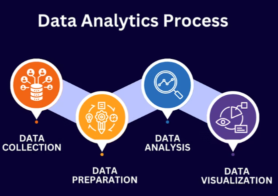

```{r setup, warning=F, message=F}
# this line specifies options for default options for all R Chunks
knitr::opts_chunk$set(echo=F)

# suppress scientific notation
options(scipen=100)
# avoid system issues
options(install.packages.check.source = "no")

# install helper package that loads and installs other packages, if needed
if (!require("pacman")) install.packages("pacman", repos = "http://lib.stat.cmu.edu/R/CRAN/")

# install and load required packages
# pacman should be first package in parentheses and then list others
pacman::p_load(pacman,tidyverse, magrittr, tidyquant, ggthemes, 
               RColorBrewer, highcharter, kableExtra, dygraphs, 
               gridExtra, plotly, gt, broom, emmeans, multcomp,
               multcompView)

# verify packages
#p_loaded()


```

# Intro

## Row

### Column {width="50%"}

**Background**

-   EDA is 2026 should be interactive and leverage AI

-   This course teaches students to explore, analyze, and
    communicate with data.

-   Analysts and consultants learn these skills 'on the
    job'.

-   This course is designed to 'flatten' the learning curve
    for young analysts.

### Column {width="50%"}


# Why?

## Row

### Column {width="50%"}

**Why Create this Course?**

-   Whitman students receive excellent technical and
    analytical training.
-   Putting those skills to use in a creative and
    exploratory setting is essential.
-   This course will enourage students to
    -   develop analytical questions
    -   explore Data
    -   understand what to do when they hit a 'dead-end'
    -   effectiviely communicate exploration findings,
        visually, orally and in writing
    -   effectively and securely collaborate with others

### Column {width="50%"}

# Redundant?

## Row

### Column {width="50%"}

-   **Are there other courses on campus that teach these
    skills?**

-   The short answer is no.

    -   There are two psychology courses that list EDA as
        one of many topics they cover.
        -   These courses do not teach this material
            interactively or include projects.
    -   There are Newhouse courses that focus on digital
        journalism.
    -   These courses cover the basics of creating online
        publications that incorporate data using GitHub.
        -   These courses do not focus on
            -   creatively aggregating and exporting data.
            -   communicating exploration findings.
            -   developing an analyses plan and hypotheses
                based on data exploration.

-   This course may be open up to interested students from
    other colleges on campus **IF** they have intermediate
    or above coding skills.

### Column {width="50%"}

# Tech Agility

## Row

### Column {width="50%"}

-   GitHub Projects and Websites

    -   Students will develop multiple repositories.

    -   Each assignment will be a small repository

    -   Students will work together on repository projects
        to learn about version control

-   Learn how to format and publish work using Quarto and
    GitHub together

-   Agility with R and/or Python and using AI to facilitate
    coding skills

    -   Learning AI's limitations and flaws

-   Students will combine these skills to create interactive
    website presentations.

### Column {width="50%"}


# Analytical

## Row

### Column {width="50%"}

-   Overarching goal of this course is to teach students how
    to explore unfamiliar data to

    -   Develop analytical questions and hypotheses

    -   Examine data interactively and modify as needed

    -   Use AI to find related data

    -   Visualize and Analyze data to test hypotheses

    -   Develop and communicate conclusions interactively

### Column {width="50%"}



# Example

# Interactive Exploration Plots

```{r }


top_all <- read_csv("data/top_all.csv", show_col_types=F) |>
  arrange(movie, rank) |>
  distinct(movie, .keep_all = TRUE) |>
  filter(rank <= 100) |>
  mutate(release_qtr=quarter(release_date),
         release_month=month(release_date),
         release_year = year(release_date),
         period = ifelse(release_year <= 2019, "prepan", NA),
         period = ifelse(release_year >=2020 & release_year <=2021, 
                         "pan", period),
         period = ifelse(release_year >=2022, "postpan", period),
         rpt = tot_gross/num_theaters)


top_all2 <- top_all |>
  mutate(tot_gross = ifelse(movie=="Hocus Pocus", 4828000, tot_gross),
         rpt = tot_gross/num_theaters,
         ln_rpt = log(rpt))

top_all_6distrib <- top_all2 |>
    filter(distrib %in% c("Paramount Pictures", 
                        "Sony Pictures Releasing",
                        "Lionsgate",
                        "Walt Disney Studios Motion Pictures",
                        "Warner Bros.",
                        "Universal Pictures"))

top_all6_qtr <- top_all_6distrib |>
  group_by(release_year, release_qtr, distrib, period) |>
  summarize(tot_rpt = sum(rpt, na.rm=T),
            ln_tot_rpt = log(tot_rpt),
            mn_rpt = mean(rpt, na.rm=T),
            ln_mn_rpt = log(mn_rpt)) |>
  mutate(date_soq = yq(paste(release_year, release_qtr)), # create som date var
         date = ceiling_date(date_soq, "quarter")-1)

top_all6wide <- top_all6_qtr |>
  pivot_wider(id_cols=date, names_from=distrib, values_from=tot_rpt) 
names(top_all6wide) = c("date", "Lionsgate", "Paramount", 
                        "Sony", "Universal", "Disney", "WB")

top_all6lnwide <- top_all6_qtr |>
  pivot_wider(id_cols=date, names_from=distrib, values_from=ln_tot_rpt) 
names(top_all6lnwide) = c("date", "Lionsgate", "Paramount", 
                        "Sony", "Universal", "Disney", "WB")

all6_xts <-  xts(x=top_all6wide[,2:7], order.by=top_all6wide$date)

all6ln_xts <- xts(x=top_all6lnwide[,2:7], order.by=top_all6lnwide$date)
  


```

```{r}

# extract dates
dates <- zoo::index(all6_xts)

highchart(type = "stock") |>
  hc_xAxis(type = "datetime") |>
  hc_title(text = "Distribution Efficincy Index by Quarter") |>

  # turn legend back on
  hc_legend(enabled = TRUE) |>

  hc_add_series(
    data = list_parse2(data.frame(
      x = datetime_to_timestamp(dates),
      y = all6_xts$Lionsgate
    )),
    name = "Lionsgate",
    color = "green"
  ) |>

  hc_add_series(
    data = list_parse2(data.frame(
      x = datetime_to_timestamp(dates),
      y = all6_xts$Paramount
    )),
    name = "Paramount",
    color = "royalblue"
  ) |>

  hc_add_series(
    data = list_parse2(data.frame(
      x = datetime_to_timestamp(dates),
      y = all6_xts$Sony
    )),
    name = "Sony",
    color = "purple"
  ) |>
  
    hc_add_series(
    data = list_parse2(data.frame(
      x = datetime_to_timestamp(dates),
      y = all6_xts$Universal
    )),
    name = "Universal",
    color = "darkcyan"
  ) |>
  
    hc_add_series(
    data = list_parse2(data.frame(
      x = datetime_to_timestamp(dates),
      y = all6_xts$Disney
    )),
    name = "Disney",
    color = "blue"
  ) |>
  
    hc_add_series(
    data = list_parse2(data.frame(
      x = datetime_to_timestamp(dates),
      y = all6_xts$WB
    )),
    name = "Warner Bros.",
    color = "darkblue"
  ) |>

  # shaded region
  hc_xAxis(
    plotBands = list(
      list(
        from  = datetime_to_timestamp(as.Date("2020-03-01")),
        to    = datetime_to_timestamp(as.Date("2021-06-01")),
        color = "rgba(200,200,200,0.3)",
        label = list(text = "Covid Restrictions")
      )
    )
  ) |>

  # range selector
  hc_rangeSelector(enabled = TRUE)

```

# Bar Plot

```{r }

top_all_6distrib_plt <- top_all_6distrib |>
  filter(period!="pan") |>
  mutate(RPT = (rpt/1000000) |> round(2),
         QTR = factor(release_qtr),
         Distrib = factor(distrib,
                           levels=c("Walt Disney Studios Motion Pictures",
                                    "Warner Bros.",
                                    "Universal Pictures",
                                    "Sony Pictures Releasing",
                                    "Paramount Pictures",
                                    "Lionsgate"),
                           labels=c("D", "W", "U", "S", "P", "L")),
         Period = factor(period, 
                          levels=c("prepan", "postpan"),
                          labels=c("Pre-Pandemic", "Post-Pandemic"))) |>
  rename("LN_RPT" = "ln_rpt") 

#write_csv(top_all_6distrib_plt, "data/top_all_6distrib_aov.csv")


(barplot_gg <- top_all_6distrib_plt |> 
  ggplot() +
  geom_bar(aes(x=Distrib, y=RPT, fill=QTR),
         stat="identity", position="stack") +
  scale_fill_manual(values = c("lightblue", "cadetblue", "royalblue", "blue"))+
  theme_classic() +
  facet_grid(~Period) +
  labs(x="Distributor", y="Revenue per Theater (mill.)",
       title="Distribution Efficiency Index", fill="Quarter",
       subtitle="D=Disney   W=Warner Bros.   U=Universal   S=Sony   P=Paramount   L=Lionsgate"))


```

# Interactive

```{r}

plotly::ggplotly(barplot_gg, tooltip = c("x", "y", "fill"))


```

# ANOVA

```{r}

aov_model <- aov(LN_RPT ~ Period + Distrib + QTR + 
                   Distrib*QTR + Distrib*Period + QTR*Period +
                   Distrib*QTR*Period,
                 data = top_all_6distrib_plt)
#(aov_smry <- summary(aov_model)) 


tidy(aov_model) |>
  gt() |>
  fmt_number(columns = c(statistic, p.value), decimals = 4) |>
  tab_header(
    title = "Analysis of Variance - LN Distribution Efficiency Index",
    subtitle = "Pre vs. Post Pandemic by Quarter and Disributor"
  )


```


